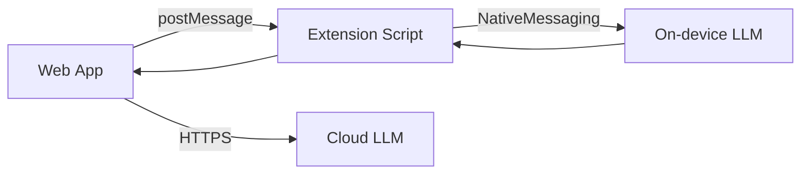

# Local‑First Chat Completion JS/TS API Spec (**LocalLLM**)

> **Naming update:** The SDK/class/package/global originally shown as *MyAI* is now renamed **LocalLLM**.

---

## 1 — Core Principles

1. **Local‑first, cloud‑optional**  – When a browser extension exposes an on‑device model *and that model is available*, requests execute locally; otherwise the Web App falls back to HTTPS (`/v1/chat/completions`).
2. **Single‑source availability flag** – The Web App consults **only** `window.localLLM.available`. A value of `true` guarantees the model is ready; `false` means “route to cloud.” No secondary probes or duplicate APIs.
3. **OpenAI‑compatible surface** – All OpenAI request/response shapes still work. Developers swap endpoints, not payloads.
4. **Modern JS class API** – `class LocalLLM` (ES2022) is safe across all evergreen browsers by June 2025. A stub at `window.localLLM` is injected for zero‑config hacking.
5. **Typed SaaS development** – The NPM package (`localLLM`) exports the same class plus full `*.d.ts` typings for Node/Edge runtimes.
6. **Graceful degradation** – The Web App evaluates `window.localLLM.available` on each request (cheap), never relying on extension‑initiated network calls.

---

## 2 — Runtime Architecture



- **Extension bridge** – Handles only on‑device inference. It **never** talks to the cloud.
- **Client fallback** – The Web App reads `window.localLLM?.available`.
  - `true` → use extension path
  - `false` (or property undefined) → use cloud path
- The JSON contract is identical on both paths.

---

## 3 — Usage Examples

### 3.0 Availability check (single source of truth)

```js
if (window.localLLM?.available) {
  // On‑device path
  console.log("Running locally");
} else {
  // Cloud fallback
  console.warn("Local LLM unavailable");
  // fetch("/v1/chat/completions", …)
}
```

> The flag is set once per page‑load by the extension and remains authoritative for the session.

### 3.1 Basic completion (non‑stream)

```html
<!DOCTYPE html>
<html>
<head><meta charset="utf-8" /></head>
<body>
<script src="localLLM-injected.js"></script>
<script>
  (async () => {
    const res = await localLLM.chat.completions.create({
      model: "localLLM-pro-2025",
      messages: [
        { role: "system", content: "You are a terse assistant." },
        { role: "user", content: "Hello local world" }
      ]
    });
    console.log(res.choices[0].message.content);
  })();
</script>
</body>
</html>
```

### 3.2 Completion with streaming (typed SaaS)

```ts
import LocalLLM from "localLLM";

const llm = new LocalLLM({
  apiKey: process.env.LOCALLLM_API_KEY,     // cloud fallback only
  baseURL: "https://api.localLLM.example"
});

await llm.chat.completions.create({
  model: "localLLM-pro-2025",
  messages: [
    { role: "system", content: "You are concise." },
    { role: "user", content: "Give me a limerick." }
  ],
  stream: true
}).on("delta", chunk => process.stdout.write(chunk.delta.content ?? ""));
```

### 3.3 Multi‑turn conversation loop

```ts
import LocalLLM from "localLLM";

const llm = new LocalLLM();

const history = [
  { role: "system", content: "You are an expert Unix assistant." }
];

async function ask(question: string) {
  history.push({ role: "user", content: question });
  const resp = await llm.chat.completions.create({
    model: "localLLM-pro-2025",
    messages: history,
    temperature: 0.7
  });
  const answer = resp.choices[0].message;
  history.push(answer);
  return answer.content;
}
```

---

## 4 — Transport Selection Logic

```ts
function selectTransport(): "extension" | "https" {
  return (window as any).localLLM?.available ? "extension" : "https";
}
```

---

## 5 — Extension Messaging Contract

### 5.1 One‑shot

```ts
{
  kind: "localllm_request",
  requestId: "uuid",
  body: NormalizedChatCompletionRequest
}
```

### 5.2 Streaming

```ts
port.postMessage({ type: "start", request: {/* … */} });
```

---

## 6 — `types.d.ts` (excerpt)

```ts
declare global {
  interface Window {
    localLLM?: {
      /** Authoritative availability flag */
      available: boolean;
      chat: {
        completions: {
          create: typeof import("localLLM").default.prototype.chat.completions.create;
        };
      };
    };
  }
}

declare module "localLLM" {
  export default class LocalLLM {
    readonly available: boolean; // mirrors window.localLLM.available
    chat: {
      completions: {
        create: typeof import("openai").Chat.Completions.create;
      };
    };
    constructor(init?: { apiKey?: string; baseURL?: string });
  }
}
```

---

## 7 — Error Taxonomy

`AuthenticationError`, `RateLimitError`, `BadRequestError`, `InternalServerError` – same as OpenAI SDK.

---

## 8 — Security & Privacy

On‑device requests stay local; cloud fallback is opt‑in via API key.

---

*Document version 2025‑07‑04*

